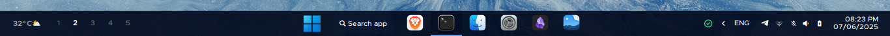
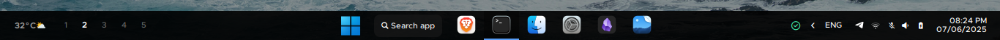

<div align='center'>
    <h1>【 Waybar Config -Minimalist Dotfiles 】</h1>
    My dotfiles for users who want to have <b>Minimalist Waybar</b> configurations ;) <br>
<br>

[](https://hyprland.org/)
[](https://github.com/Alexays/Waybar)
 

</div>


<div align="center">
    <h2>• Preview •</h2>
    <h3></h3>
</div>


### 1. Simple

##### Material-Dark

##### Dark

##### Light

My original Waybar customization in minimal and simple style - `config-simple` & `style-simple.css`


## 2. Win

##### Material-Dark

##### Dark

##### Light

Windows 11 style based Waybar customization - `config-win` & `style-win.css`
<br>

<br>
<div align="center">
    <h2>• Prerequisites •</h2>
    <h3></h3>
</div>

- **Required Fonts**: **Metropolis** (text), **JetBrainsMono Nerd Font Propo** (for icons) <br>
&nbsp; *The fonts aren't necessarily required, but recommended to install [Metropolois Font](https://www.1001fonts.com/metropolis-font.html) for a modern look.*
<br>

- **Packages**: `waybar, libpulse, waybar-module-pacman-updates-git`
```bash
sudo pacman -S --needed ttf-jetbrains-mono-nerd waybar libpulse && yay -S --needed waybar-module-pacman-updates-git
```

<br>
<div align="center">
    <h2>• Installation •</h2>
    <h3></h3>
</div>

> [!IMPORTANT]
> If you already have your own configs in `~/.config/waybar`, make sure you backup or move it somewhere else. <br>
<br>

1. Install dotfiles into Waybar:
```bash
cd ~/
git clone https://github.com/miniMinn24/minimal-waybar
cd minimal-waybar
cp -r waybar ~/.config/
```
<br>

2. Start as a background process. e.g., in your `hyprland.conf`. <br>

&nbsp; *Execute Waybar - **Simple style**:*
```
exec-once = waybar -c ~/.config/waybar/config-simple -s ~/.config/waybar/style-simple.css &
```
&nbsp; *Or, **Win style**:*
```
exec-once = waybar -c ~/.config/waybar/config-win -s ~/.config/waybar/style-win.css &
```
<br>

## Styling
In `~/.config/waybar/themes/main.css`, you can switch the theme to your liking (`material-dark, light, dark`):

```css
@import "material-dark.css"; 
```

Then, reload your Waybar to apply changes.

---

<br>
<div align="center">
    <h2>• About Me •</h2>
</div>

I'm just a Arch linux user who loves to customize **Hyprland** for my own environment. After getting along with it, I wanted to share my own dotfiles for anyone who wants to start Hyprland simple. <br>

I'll be looking forward to update this Waybar dofiles for like new `themes` and `looks`, just when I have finished cleaning the code xD <br>
I'll also try to share my other Hyprland dofiles like `Hyprland setup`, ... (maybe?) <br>

<div align="center">
  
 ✨ ***Thank You For Visiting BTW!*** ✨

</div>


